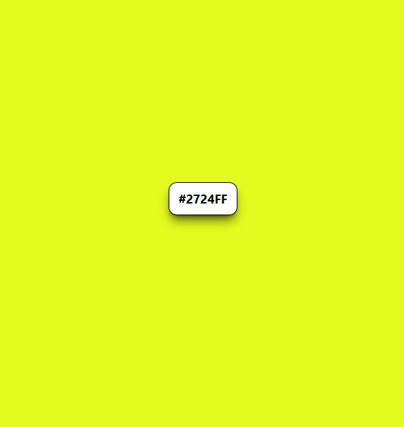
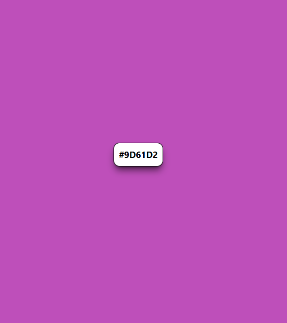

# 🎨 BG Color Changer

A simple and interactive background color changer built using **HTML**, **Tailwind CSS**, and **JavaScript**.  
Each time you click the button, the background color of the page changes to a random color, and the generated color code is displayed on the button.

---

## 🚀 Demo


  

  

[live@](https://aljusabu.github.io/Background-Color-Changer/)

---

## 🧩 Features

- Generates random background colors dynamically  
- Displays the corresponding hex color code on the button  
- Built with Tailwind CSS for smooth styling and hover effects  
- Lightweight and fast — runs entirely in the browser

---

## 🛠️ Technologies Used

- **HTML5**
- **Tailwind CSS (via CDN)**
- **JavaScript (Vanilla JS)**

---

## 📂 Project Structure

```

project-folder/
│
├── index.html        # Main HTML file
├── script.js         # JavaScript logic for color generation
└── README.md         # Project documentation

```

---

## ⚙️ How to Run the Project

1. Clone or download this repository  
2. Open the folder in VS Code or your favorite editor  
3. Open the `index.html` file in your browser  
4. Click the **“Click me”** button and watch the background color change!

---

## 📘 How It Works

- The button is selected using `document.querySelector("#btn")`
- When clicked, it triggers a function that:
  - Generates a random 6-digit hex color code
  - Changes the document’s background to that color
  - Displays the same color code on the button

Example:
```js
document.body.style.backgroundColor = randomColor()
btn.innerHTML = randomColor()
````

---


## 🧑‍💻 Author

**Alju Sabu**  
Feel free to fork and improve this project! 💫

---
